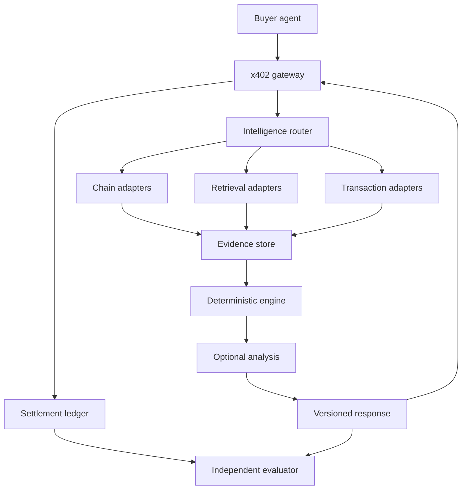

# Prime-Agent x402 Intelligence Stack v1.0

**Creator:** Codie Lanoue  
**Date:** 2026-09-26  
**Status:** executable design specification; no deployment or revenue claim

## 1. Product contract

Prime-Agent sells provenance-bearing observations and composed decisions about onchain objects through x402. The common unit of work is an **EvidenceRecord**, shared by multiple products only when its license, chain, network, block context, freshness and access scope permit reuse. Payment, computation and evaluation are distinct planes. A request that pays twice may legitimately receive the same public observation twice; it must never receive another customer's private inputs or results.

### System map



The router resolves a product dependency graph, pins a coherent chain context, estimates maximum spend, reads permissible cache entries, collects missing evidence, and composes one response. It does not decide that a payment succeeded. The evaluator reads payment receipts and response traces through a separate read-only path; seller counters cannot be edited into its ledger.

## 2. HTTP and payment lifecycle

1. Parse and validate request limits without doing expensive work. Choose a fixed product tier and quote the exact price, token, scheme and network. Return x402 v2 `402` requirements for an unsigned request. Keep the quote bound to the canonical resource and request digest.
2. Accept `PAYMENT-SIGNATURE` only through a verified scheme/network adapter. Enforce bounded expiry, canonical path/query, chain ID, asset, payee, amount and replay protection. Rate-limit unsigned probes and authenticated work separately.
3. Reserve an idempotency key derived from payment authorization and request digest. One authorization cannot buy two distinct responses. A duplicate retry retrieves the same stored result and receipt or resumes the original operation.
4. Execute a bounded job using the quote's workload cap. Reserve cost budget before RPC calls. If required evidence is unavailable or stale, fail explicitly; do not silently substitute a weaker verdict.
5. Settle through a configured facilitator or local scheme and persist its transaction/commitment identifier, network, payer, amount and status. Release a successful response only when the configured scheme's settlement condition is met. Handle a settlement timeout as `unknown`, reconcile it before retrying, and avoid submitting a duplicate authorization blindly.
6. Record delivery status separately from settlement status. A settled but undelivered result is a support/retry obligation; retries can retrieve it without another charge for a bounded period. Never count `verified` or `submitted` as `settled_revenue`.

The x402 reference describes `PAYMENT-REQUIRED`, `PAYMENT-SIGNATURE`, facilitator verification/settlement and `PAYMENT-RESPONSE` for its typical HTTP flow. Exact, upto and batch settlement have distinct guarantees; v1 uses **exact** with a fixed price per route and a pinned network. Dynamic costs are capped internally rather than silently changing the amount after authorization. Base is the first payment path; Solana may be offered only after a separate payer, facilitator, settlement, replay and retry conformance run. Chain data coverage and payment network support are configured independently.

## 3. Product dependency graph and provisional prices

| Product | USD target | Required evidence | Hard failure or degraded result |
| --- | ---: | --- | --- |
| `/chain/status` | 0.001 | chain head and provider status | fail on provider disagreement or stale head |
| `/token/balance` | 0.002 | owner, asset, chain, block balance | fail on invalid address or unsupported token |
| `/token/metadata` | 0.003 | contract facts and verification state | label unknown metadata; never imply contract safety |
| `/contract/read` | 0.003–0.005 | allowlisted read call and ABI provenance | reject arbitrary target/method or excessive gas |
| `/wallet/context` | 0.007 | balances, approvals, bounded activity | return coverage window and absent dimensions |
| `/token/context` | 0.009 | metadata, holder/liquidity/activity feeds | return coverage and source timestamps |
| `/token/verdict` | 0.020 | token context and versioned risk rules | `insufficient_evidence` if required dimensions missing |
| `/tx/explain` | 0.030 | normalized call decode and contract metadata | return unknown selectors, never guess intent |
| `/tx/preflight` | 0.050 | pinned simulation and risk rules | fail if simulation is unavailable; report assumptions |
| `/change/delta` | 0.050+ | two comparable snapshots | reject incompatible versions or coverage |
| `/deep-analysis` | 0.100+ | grounded context and model budget | opt-in route; fail closed on exceeded model budget |

These are **hypotheses**, not validated willingness to pay. For exact payments, each route publishes a fixed quote; tier changes receive a new quote. A product cannot silently invoke a paid downstream API whose worst-case cost exceeds the quote's spend cap.

Launch with `/chain/status`, `/token/metadata`, `/token/context` and `/token/verdict` on one supported data chain; these exercise acquisition, graph reuse and margin. Add balance/wallet, explain and preflight only when the corresponding data adapters and evaluator fixtures pass. `/change/delta` needs scheduled snapshots and explicit retention. The model route is last.

## 4. Evidence graph

An observation is immutable. A correction adds a superseding observation; the underlying value is never overwritten. The minimum schema is:

```json
{
  "evidence_id": "sha256(canonical_record)",
  "entity": {"network": "eip155:8453", "type": "token", "id": "normalized-address"},
  "predicate": "metadata.decimals",
  "value": 6,
  "source": {"provider_id": "registered-adapter", "method": "eth_call", "source_ref": "transaction-or-block-reference"},
  "context": {"block_number": 100, "block_hash": "observed-hash", "observed_at": "2026-09-26T13:00:00Z"},
  "quality": {"finality": "provider-reported", "confidence_class": "direct-chain-read", "coverage": "single-contract"},
  "governance": {"visibility": "public", "license_id": "source-license-id", "expires_at": "policy-derived-time"},
  "versions": {"adapter": "1.0", "normalizer": "1.0"},
  "supersedes": []
}
```

The numbers and addresses above illustrate schema shape and are not observed chain data. `entity`, `predicate`, source method, block identity and normalization version are part of a canonical cache key. A public observation can be reused across payers if source terms permit it. A buyer-supplied transaction draft, addresses marked private, personalized explanation and payment receipt are tenant scoped. Never put secrets or raw authorization signatures in the evidence graph. Encrypt sensitive input, bound retention, and keep payer identity out of public cache keys.

For mutable facts, define TTL by predicate and block distance; contract bytecode can live longer than balance, allowance or liquidity. A reorg invalidates observations from the orphaned block and any dependent verdicts. Store parent IDs on every composed response. Use single-flight deduplication per key, bounded LRU hot cache plus durable indexed storage, and admission only if predicted reuse or provenance value covers storage cost. A paid request **may** add reusable evidence; it is not assumed to improve the graph unless an independently useful, licensed observation was produced.

## 5. Deterministic verdict and explanation

Risk rules are versioned functions over evidence and coverage. Output: `verdict ∈ {low, elevated, high, insufficient_evidence}`, rule hits, missing inputs, block context, source references and rule version. A numeric score is optional and must be calibrated against a labeled holdout before public use. Unknown evidence never defaults to low risk. Explanations cite rule IDs and input evidence IDs. The optional model may translate or synthesize this result, but cannot change computed facts or emit new onchain claims without sourced evidence. Prompt text inside retrieved chain metadata is treated as untrusted data.

`/tx/preflight` states the exact simulation block, state overrides, included calls, expected token transfers, approvals, gas estimate range and known omissions. It cannot guarantee inclusion, final state, execution price or immunity from malicious contracts.

## 6. Economics and protected evaluation

Maintain an append-only event stream keyed by `request_id`, `quote_id`, `payment_authorization_hash`, `settlement_id`, product version and buyer pseudonym. States: `quoted → verified → executing → result_ready → settling → settled → delivered`, plus `failed`, `settlement_unknown`, and `settled_undelivered`. Reconciliation independently joins facilitator results to chain settlement where possible and logs unexplained differences. Count revenue only for reconciled successful settlements, net of refunds and reversals; label immature or deferred commitments separately.

For each product and day, publish counts of attempts, distinct settled payers, repeat and returning payers, settled revenue, delivery rate, cache hits by evidence class, RPC and compute use, model spend, p50/p95 latency, and reconciled contribution margin. Attribute shared computation once to the original acquisition, then allocate its cost to products using a declared method; report both cash margin and amortized margin. Show unknown costs explicitly instead of treating them as zero.

```text
cash_contribution = settled_revenue − refunds − RPC_spend − compute_spend
                    − model_spend − settlement_fees − paid_source_spend
payer_repeat_rate = payers_with_2_plus_settled_purchases / settled_payers
7d_retention = eligible_payers_who_return_in_days_1_to_7 / eligible_payers
```

A payer is a normalized settlement identity, not automatically a unique human or business. Exclude seller-owned wallets, test traffic, refunded payments and detected linked identities from **independent buyer** promotion counts; maintain an uncertainty range where independence cannot be established. The proposed `RepeatRate × Retention × RevenuePerPayer × DeliveryReliability` can be a displayed diagnostic after cohort and units are defined; do not optimize it alone because a few high-spend wallets can dominate. Guardrails are reconciled margin, independent payer cohorts, delivery reliability and data quality.

### Promotion rules, preregistered per experiment

| Stage | Evidence to advance | Response to failure |
| --- | --- | --- |
| Prototype | conformance fixtures, cost envelope, correct 402/settlement, full provenance | fix or archive |
| Discovery | at least 5 independently settled payers in a declared window; valid delivery; no material reconciliation gap | revise positioning; preserve negative result |
| Repeat | repeat purchases from more than one independent payer cohort; positive reconciled margin; reliability floor | reprice, cache or narrow scope |
| Expand | at least 25 independent payers plus retention and margin over two windows | increase capacity under budget |
| Scale | at least 100 independent payers plus sustained margin, latency and audit checks | scale gradually with rollback |

Five, 25 and 100 are decision thresholds, not statistical proof of demand. Specify windows, margin floor, delivery floor, denominator and minimum cohort before launching each experiment. The optimizer can propose prices and routes but cannot alter evaluator code, receipt ledger, wallet exclusion rules or historical records. Promotions are reversible configuration changes with canary exposure and rollback on settlement divergence, cost overrun, reorg error or elevated error rate.

## 7. Practical implementation boundary

- **Gateway:** x402 v2 adapter, fixed quotes, facilitator/network configuration, replay and idempotency store, per-route rate limits.
- **Router:** dependency DAG, typed budgets, coherent snapshot selection and cancellation.
- **Adapters:** one chain/network per tested adapter; typed RPC, external retrieval and transaction simulation with provider health and cost accounting.
- **Evidence store:** append-only observations, source rights, block lineage, public/tenant scope, TTL and dependency invalidation.
- **Decision engine:** pure deterministic rules, tested against adversarial and incomplete evidence fixtures.
- **Analytics:** append-only operational events; settlement reconciliation outside seller counters; cohort and cost allocation jobs.
- **Optimizer:** experiment registry and limited config proposals; promotion only from evaluator results.

Initial deploy can be one stateless HTTP process plus a persistent relational database and a read-only evaluator job. Separate process authority and credentials matter more than physical microservices at this stage. Use bounded background work for reconciliation and invalidation. Do not expose arbitrary contract execution or wallet custody from this seller API.

### Required acceptance tests

1. Correct 402 challenge, successful payment and settlement receipt on a supported test network; negative cases for wrong network, payee, amount, asset, expiry, route and replay.
2. Concurrency and timeout tests show one charge per idempotency key, including a settlement response lost after payment succeeded.
3. Cache tests cross payer boundaries for public evidence and reject cross payer reuse for tenant scoped data; reorg and stale-data tests invalidate composed verdicts.
4. Independent rule fixtures cover missing dimensions, contradictory providers, unknown ABI, malicious metadata, unsupported token behavior and simulation failure.
5. Evaluator recomputes revenue from receipts, detects injected seller counter inflation and flags unmatched paid/undelivered responses.
6. A small live canary reports actual settled transactions, external RPC invoices or measured usage, p95 latency and net margin before any demand or profitability claim.

## 8. Source basis and current limits

- [x402 foundation specification and HTTP flow](https://github.com/x402-foundation/x402): reference payment messages, facilitator flow and network/scheme separation.
- [x402 Bazaar discovery documentation](https://github.com/x402-foundation/x402/blob/main/docs/extensions/bazaar.mdx): route descriptions and input/output schemas for discoverability. Discovery/index acceptance must be observed rather than assumed.
- [x402 batch settlement scheme](https://github.com/x402-foundation/x402/blob/main/specs/schemes/batch-settlement/scheme_batch_settlement.md): deferred commitments are economically different from immediate settled receipts.

No production endpoint, contract data provider, facilitator account, paying buyer, hosting budget or measured margin is established by this document. The product ladder and growth loop remain hypotheses until settlement and independent buyer evidence exist.
